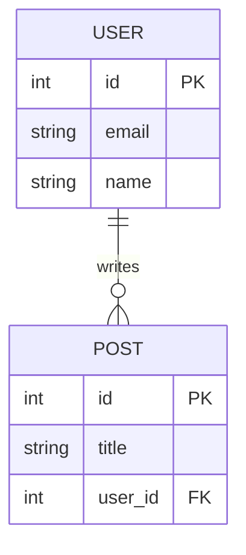

# Data Model

## Instructions

Create or update `docs/data_model.md` based on `docs/requirements.md` and `docs/vision.md`.
Produce an optional Mermaid ER diagram followed by an attribute table for each entity.

## DO NOT

- Use PlantUML
- Skip the attribute table for any entity that has more than a primary key
- Invent entities not derivable from requirements
- Hard-code pgvector columns unless a FR mentions search, similarity, or RAG

## Output Format

```markdown
# Data Model

## Entity Relationship Diagram



## Entities

### User

| Attribute | Type | Constraints | Description |
|---|---|---|---|
| id | integer | PK, auto | Primary key |
| email | varchar(255) | NOT NULL, UNIQUE | Login identifier |
| name | varchar(255) | NOT NULL | Display name |
| created_at | timestamp | NOT NULL, DEFAULT now() | Creation time |

### Post

| Attribute | Type | Constraints | Description |
|---|---|---|---|
| id | integer | PK, auto | Primary key |
| title | varchar(500) | NOT NULL | Post title |
| body | text | NOT NULL | Content |
| user_id | integer | FK → User.id | Author |
| embedding | vector(1536) | nullable | Semantic embedding for search |
| created_at | timestamp | NOT NULL, DEFAULT now() | Creation time |
```

## pgvector notes

Add a `vector(1536)` column (and note "requires pgvector extension") to any entity whose
features mention: semantic search, similarity search, RAG, embeddings, recommendations, or "find similar".

## Workflow

1. Read `docs/requirements.md` to identify entities from FR user stories
2. Read `docs/vision.md` for domain context
3. Infer relationships (one-to-many, many-to-many) from requirements
4. Draw Mermaid ER diagram (skip if < 2 entities)
5. Write attribute table for each entity
6. Mark any vector columns needed for search features
7. Write `docs/data_model.md`
8. Suggest next step: `/feature-spec`
